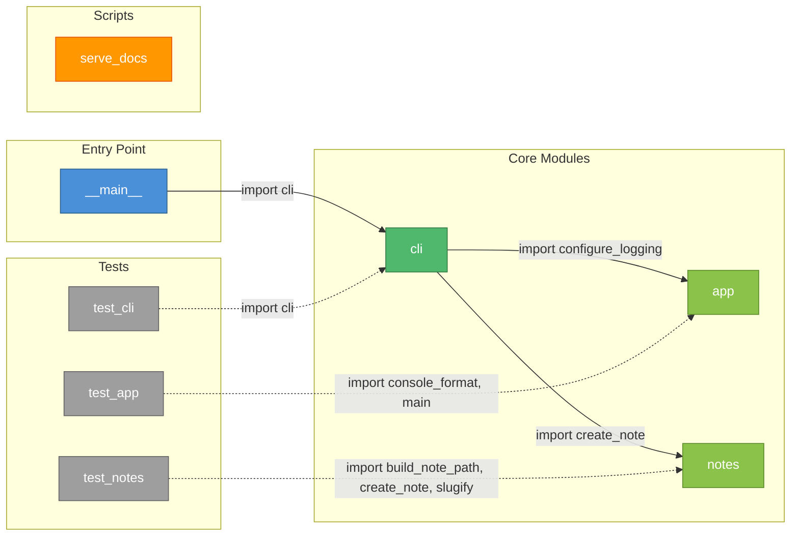

# Module Dependency Graph

## Key

| Style | Meaning |
|-------|---------|
| Blue | Entry point |
| Green | Core hub module (imports other internal modules) |
| Light green | Leaf module (no internal imports — safe to change in isolation) |
| Grey | Test modules |
| Orange | Standalone scripts |
| Solid arrow | Runtime dependency |
| Dashed arrow | Test dependency |

## Circular Dependencies

**None detected.** The dependency graph is a clean DAG (directed acyclic graph).

## Safe-to-Change Analysis

| Module | Risk | Why |
|--------|------|-----|
| `notes.py` | Low | Leaf module. Only `cli.py` and `test_notes.py` depend on it. |
| `app.py` | Low | Leaf module. Only `cli.py` and `test_app.py` depend on it. |
| `cli.py` | Medium | Hub module. `__main__.py` and `test_cli.py` depend on it. Changes to its public API affect the entry point. |
| `__main__.py` | Low | Only imports `cli`. No other module depends on it. |
| `serve_docs.py` | Low | Fully standalone. No internal imports at all. |
